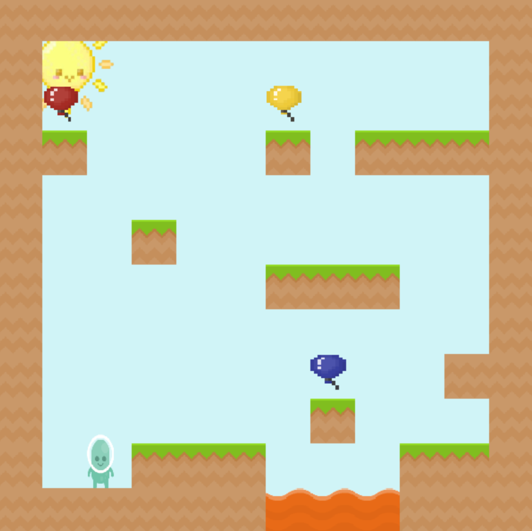

# 🎂 Enzo's Birthday 🎂

**Enzo's Birthday** é um jogo de plataforma em pixel art onde o jogador deve coletar três balões para desbloquear um bolo de aniversário e vencer o jogo! 🎈🎂

---

## 📌 Como Jogar
1. **Movimentação:**
   - 🡄 `Seta Esquerda` ou `A`: Move o personagem para a esquerda
   - 🡆 `Seta Direita` ou `D`: Move o personagem para a direita
   - ⬆ `Espaço`: Pular

2. **Objetivo:**
   - Colete os **3 balões** espalhados pelo mapa para desbloquear o **bolo de aniversário**.
   - Após coletar os balões, pegue o bolo para **vencer o jogo!** 🎉

---

## 🛠️ Como Rodar o Jogo

### **1️⃣ Requisitos**
Antes de rodar o jogo, você precisa ter o **Python 3.10+** instalado.

Além disso, instale as bibliotecas necessárias no terminal com:

pip install -r requirements.txt

### Executar o jogo
No terminal para iniciar o jogo use:

python src/main.py
