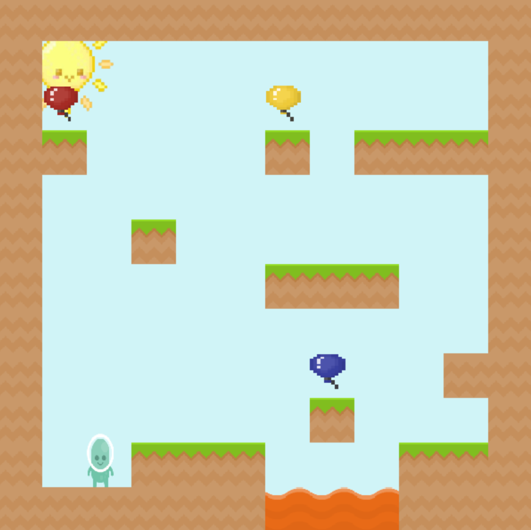

# 🎂 Enzo's Birthday 🎂 Version 1.1

**Enzo's Birthday** é um jogo de plataforma em pixel art onde o jogador deve coletar três balões para desbloquear um bolo de aniversário e vencer o jogo!

  

---

## 📌 Como Jogar
1. **Movimentação:**
   - 🡄 `Seta Esquerda` ou `A`: Move o personagem para a esquerda
   - 🡆 `Seta Direita` ou `D`: Move o personagem para a direita
   - ⬆ `Espaço`: Pular

2. **Objetivo:**
   - Colete os **3 balões** espalhados pelo mapa para desbloquear o **bolo de aniversário**.
   - Após coletar os balões, pegue o bolo para **vencer o jogo!** 

---

## 🛠️ Como Rodar o Jogo
  - Acesse a pasta dist
  - Dê um duplo clique no arquivo EnzosBirthday.exe
  - Aproveite o jogo! 
